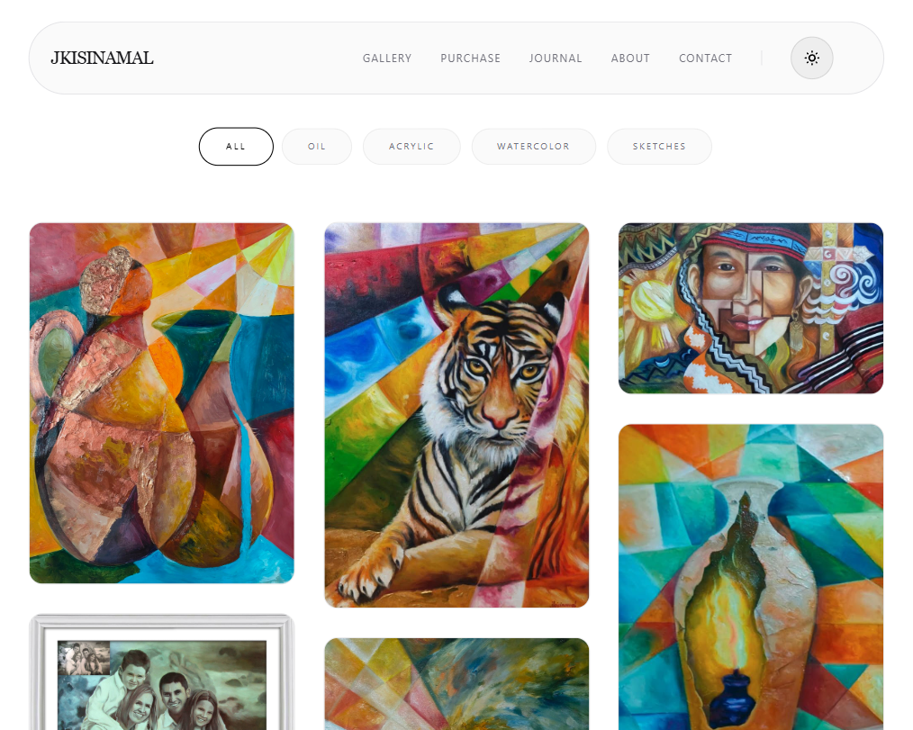

# JKISINAMAL | Professional Artist Portfolio



## Short Introduction

This project is a professional digital portfolio built for visual artist **JKISINAMAL**, designed to function as a modern online art gallery.

The goal was to create a platform where artwork becomes the main focus while maintaining strong technical performance, modern UI design, and professional branding.

Traditional social media platforms compress artwork quality and limit portfolio presentation. This website solves that problem by giving the artist full ownership over branding, presentation, and audience experience.

**Live Site:** https://jkisinamal.github.io

---

## Technologies Used

### Frontend
- HTML
- CSS
- JavaScript

---

### Styling
- Tailwind CSS
- Glassmorphism UI Design
- Responsive Grid Systems

---

### Performance Optimization
- Lazy Loading
- Image Optimization
- Layout Stability Optimization

---

### Deployment
- GitHub Pages

---

## Features

### Responsive Masonry Gallery
Displays artwork with different aspect ratios while maintaining visual balance.

Benefits:
- Better art presentation
- Cleaner browsing experience
- Efficient use of screen space

---

### Glassmorphism UI
Built modern translucent UI components to create a premium visual feel.

This improves:
- Visual branding
- Perceived professionalism
- Modern design appeal

---

### High-Resolution Image Display
Artwork remains visually sharp without heavily sacrificing performance.

This balances:

Quality ↔ Speed

which is important because users abandon slow-loading websites quickly.

---

### Mobile Optimization
The portfolio is fully responsive across:

- Phones  
- Tablets  
- Laptops  
- Desktop monitors  

---

### Centralized Art Portfolio
Allows the artist to showcase:

- Collections  
- Featured works  
- Personal branding  
- Contact information  

---

## Development Process (How It Was Built and Why)

---

### Why I Built It

Artists often depend entirely on platforms like:

- Instagram  
- Facebook  
- Art marketplaces  

These platforms create major limitations:

- Heavy image compression  
- Algorithm dependency  
- Limited customization  
- Weak personal branding control  

This website gives the artist ownership over their portfolio.

---

### Step 1: Research

Studied:

- Artist portfolios  
- Digital galleries  
- Luxury brand websites  
- User behavior on visual websites  

I noticed that visual clutter often hurts art presentation.

---

### Step 2: UX Planning

Focused on:

- Minimal distractions  
- Strong visual hierarchy  
- Easy navigation  
- Artwork-first design  

This applies design psychology:

when fewer distractions exist, users spend more time viewing the art.

---

### Step 3: Development

Built responsive layouts that could handle:

- Large artwork collections  
- Different image sizes  
- Smooth scaling across devices  

---

### Step 4: Performance Optimization

Art portfolios typically contain heavy image assets.

To solve this:

- Optimized images  
- Reduced unnecessary scripts  
- Improved loading performance  

This reduces bounce rates.

---

### Step 5: Deployment

Deployed using GitHub Pages for:

- Free hosting  
- Easy updates  
- Fast deployment workflows  

---

## What I Learned

### Technical Lessons
- Image optimization strategies  
- Responsive gallery design  
- Frontend performance optimization  

---

### Design Lessons
- Visual hierarchy  
- Minimalist design systems  
- Luxury branding presentation  

---

### Business Lessons
- Personal branding for artists  
- Digital ownership strategies  
- Platform independence  

---

## How to Improve It

### Short-Term Improvements
- Add artwork categories  
- Add search functionality  
- Improve animation polish  

---

### Medium-Term Improvements
- Add CMS support  
- Add commission inquiry forms  
- Add blog/news section  

---

### Long-Term Improvements
- E-commerce integration  
- NFT/digital collectible integration  
- International multi-language support  

---

## How to Run the Project

### Clone Repository
```bash
git clone https://github.com/jkisinamal/jkisinamal.github.io.git
```

### Enter Project Directory
```bash
cd jkisinamal.github.io
```

### Install Dependencies
```bash
npm install
```

### Run Development Server
```bash
npm run dev
```

---

## Creator

### Developed By:
**Jero Halili**  
Full-Stack Developer • AI Engineer • Database Administrator  

Portfolio: https://jerohalili.is-a.dev  
GitHub: https://github.com/jerohalili  

---

## License

MIT License

---

© 2026 JKISINAMAL. All Rights Reserved.
